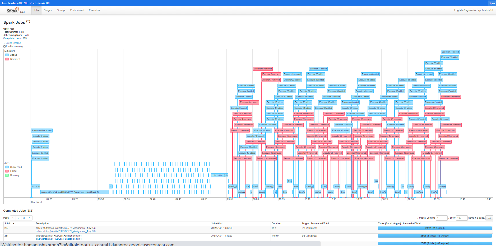
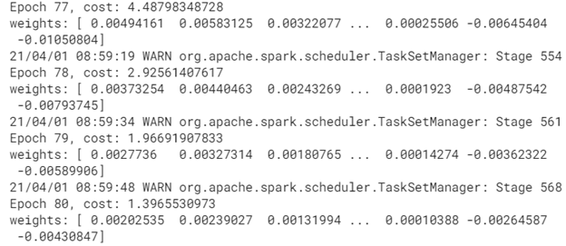
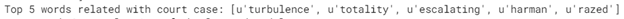
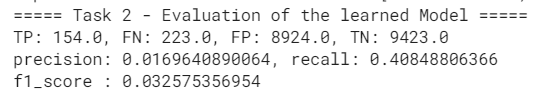
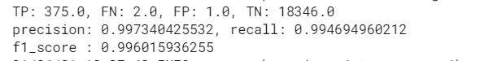

# Introduction












This project aims to apply Batch Gradient Descent via PySpark to achieve logistic regression to classify text documents. The whole data set consists of two categories which are Wikipedia pages and Australian court cases.


The ``docs``directory contains spark history logs and the result of the tasks.


# Getting Started  

Run the task by submitting the task to spark-submit. 


```python

spark-submit main_task1.py 

```


